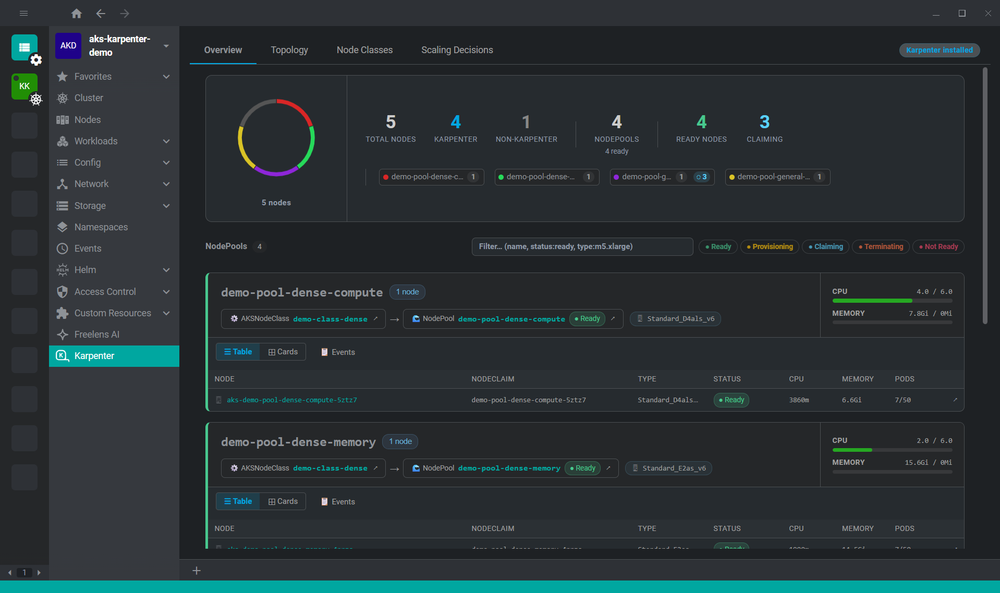
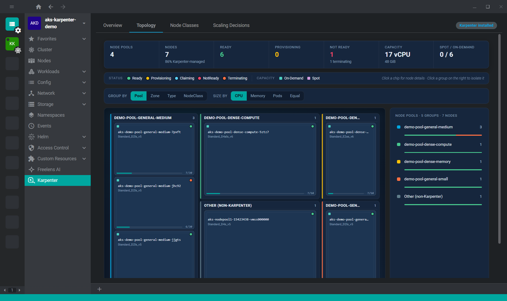
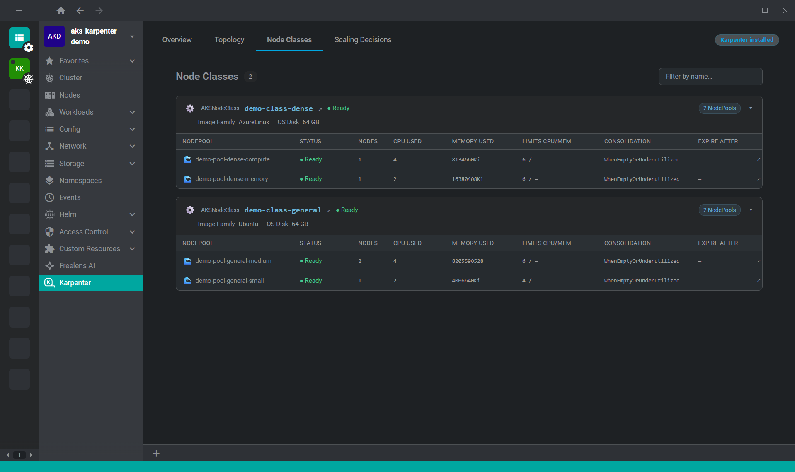
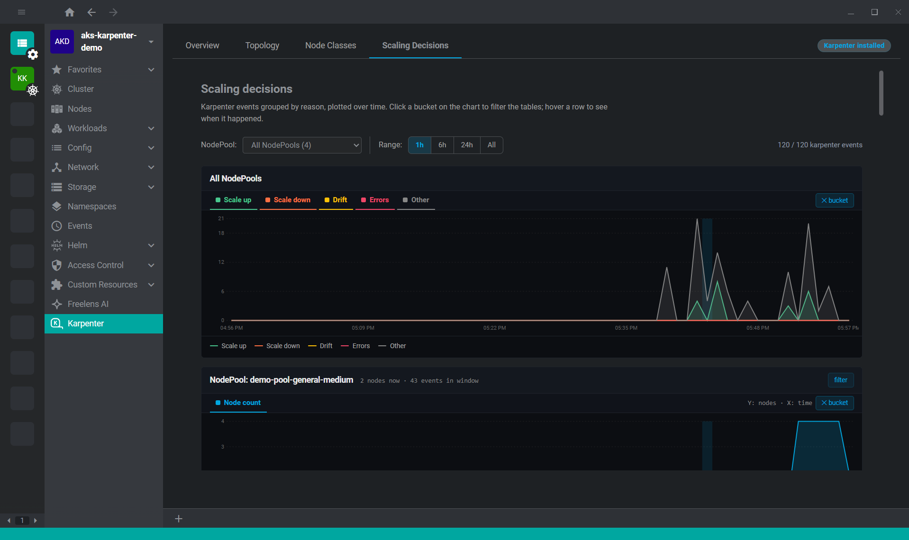
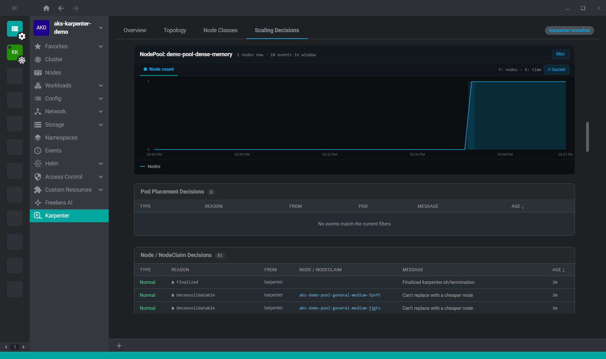

# Freelens Karpenter Extension

[Freelens](https://freelens.app) extension for [Karpenter](https://karpenter.sh/).  

A visual interface to monitor Karpenter's resources and the actions it performs.  

Born from an idea by Roberto Bandini [@robertobandini](https://github.com/robertobandini) and Alberto Lunghi [@albyrex](https://github.com/albyrex), who created the first version.

## Compatibility

At the moment, this extension is intended for clusters running Karpenter on:
- **AWS EKS**
- **Azure AKS**

## Features

The extension provides a comprehensive dashboard for monitoring Karpenter's autoscaling behavior across your Kubernetes cluster.

### Overview



Displays key performance indicators including:
- Total node count and breakdown by Karpenter-provisioned vs. existing nodes
- Per-pool node distribution with current node claims and nodes
- Resource utilization summaries for memory and CPU across the cluster

### Topology



Interactive treemap visualization that organizes nodes by:
- Node pools (color-coded regions)
- Zones and instance types (nested hierarchy)
- Adjustable grouping to explore resource distribution at different levels

Helps identify resource concentration and imbalances across your infrastructure.

### Node Classes



Displays all configured NodeClass resources (AWS EC2NodeClass or Azure AKSNodeClass) with:
- NodeClass names and providers (AWS or Azure)
- Associated NodePool references
- Configuration details for each class
- Quick access to related node pools

### Scaling Decisions





Real-time event timeline showing Karpenter's scaling actions:
- **Provisioning events**: When new nodes are created to meet workload demand
- **Consolidation events**: When Karpenter optimizes node utilization
- **Disruption events**: When nodes are removed or rescheduled
- Timestamps and detailed event metadata for audit and debugging

## Build from the source

### Prerequisites

Use [NVM](https://github.com/nvm-sh/nvm) or
[mise-en-place](https://mise.jdx.dev/) or
[windows-nvm](https://github.com/coreybutler/nvm-windows) to install the
required Node.js version.

From the root of this repository:

```sh
nvm install
# or
mise install
# or
winget install CoreyButler.NVMforWindows
nvm install 22.14.0
nvm use 22.14.0
```

Install Pnpm:

```sh
corepack install
# or
curl -fsSL https://get.pnpm.io/install.sh | sh -
# or
winget install pnpm.pnpm
```

### Build extension

```sh
corepack pnpm i
corepack pnpm build
corepack pnpm pack
```

### Install built extension

The tarball for the extension will be placed in the current directory.

In Freelens, navigate to the Extensions list and provide the path to the tarball
to be loaded, or drag and drop the extension tarball into the Freelens window.
After loading for a moment, the extension should appear in the list of enabled
extensions.

## License

Copyright (c) 2025-2026 Freelens Authors.


[MIT License](https://opensource.org/licenses/MIT)
